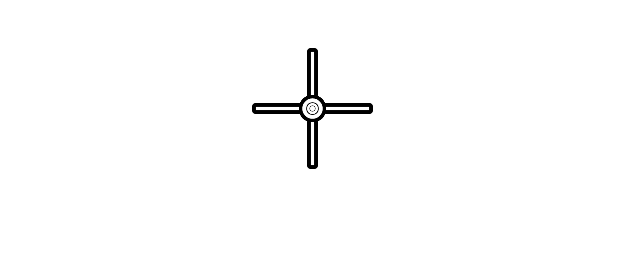

# City Labels
<style>
  .maps{background:pink;}
</style>
  
<div class="maps">

</div>
  
A way to generate a lot of unique, but memorable labels

## Installing

If you're on windows, you'll need to do:

```
pip install wheel
pip install pipwin
pipwin install numpy
pipwin install pandas
pipwin install shapely
pipwin install gdal
pipwin install fiona
pipwin install pyproj
pipwin install six
pipwin install rtree
pipwin install descartes
pipwin install geopandas
```
The requirements.txt is pointing to things on my laptop, which sucks
