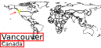

# City Labels

A way to generate a lot of unique, but memorable labels. The cities are unique, the countries are just there for context.

It uses the following libraries in a big way: 

|Library|What's it for|
|-|-|
|📈 MatPlotLib|For controlling text, and being a general layout engine|
|🐼 Pandas|For managing and manipulating the data|
|🗺 GeoPandas|For drawing maps|

:warning: **Warning:** this is pretty sketchy code. If you think it's useful, let me know and I'll add more features and tidy it up.

The SVG's that this code produces:
|Vancouver, Canada |Lagos, Nigeria |
|---|---|  
|||

And in use, after being composed in InDesign:
|Novi Sad, Serbia|Lyminge, UK|
|---|---|
|||

## The context

Since going back into the studio after Covid, BVN has had a pretty relaxed approach to where to sit. It's not exactly hot desking, and it's not exactly, well, any officially understood way of working. (Yet; maybe it will change soon?) This is a change, and it presents a few opportunities and challenges (not to sound too corporate):
* 🙂 You can sit wherever you like. If you need an hour of quiet, pick up your laptop and sit somewhere quieter.
* 😢 You can never find anyone, they might be in the studio, or they might be at home. Are you wasting your time looking? You just don't know.
BVN has movable desks in the Sydney studio.
* 🙂 If we think of the studio as a place where we do experiments then this is a major opportunity to learn something.
* 😢 We don't have a way of recording the results of any experiments we do, so we're not (yet) able to learn anything beyond some anecdotes.
* 😢 The Sydney studio has [movable desks](http://www.bvn.com.au/2019/02/11/desks-move-suitable-case-social-contagion/). This means that when an IT support call comes in "my screen is broken" there's no way to know which desk someone is talking about.

Taking all those together, there's a lot we can do (and I'll link to that once we do it), but the first step is identifying what we've got. That means giving each desk and dock an identifying name. 

Names are hard. The old favourite of _a random hex number_ e.g. `18b428` is hard to say, hard to type accurately, and hard to remember. Something like `X Æ A-12` is hard to say _and_ hard to type. What we need is something easy to say, unique, and memorable. Categories of things are pretty good for that, e.g. bond villains, types of octopus, countries. These are great, but they also suffer from being quite short lists, and if you have a lot of things to label, _Blowfelt7_ gets you back to where you started.


What we need is a list of names that is very long, something that there is a very large number of, and the thing we went with was _cities of the world_.

## So what does this code do?

It makes a lot of stickers. But I should explain how.

It starts with the basic (free) [Simple maps World Cities Database](https://simplemaps.com/data/world-cities), which has "About 43 thousand" rows. 

If we make stickers for the top 1000 most populous cities, then we get a pretty heavy bias towards Chinese cities.


That's not in itself a problem, but it means that it'll be a while before there's any significant diversity of representation. The current method takes the most populous city from each country in turn. I.e. pick one from Afghanistan, Albania, Algeria, Andorra, Angola, Antigua And Barbuda, Argentina, Armenia, Aruba, then Australia, and so on. When a country runs out (for example, Monaco only has one city) it stops delivering.

The next criteria is uniqueness. Turns out that some people (mainly the British and Spanish) were very unimaginative in naming new cities (or renaming old ones). E.g. in this dataset:

|City Name|Shows up _n_ times|
|--|--|
|Washington|	17|
|Springfield|	17|
|Franklin|	16|
|Santa Cruz|	14
|San Jose|	14
|Richmond|	14|
|Clinton|	14|

So, in the spirit of being lazy, it's first in, best dressed. Once a city name is in the main list, it's the only one that gets to stay.

The name needs to fit on the sticker too. Naively, these names are too long, based on the number of letters:

|Name|Width in characters|Width in picas|
|-|-|-|
|Dolores Hidalgo Cuna de la Independencia Nacional|49|23.154|
|San Martin Texmelucan de Labastida|34|16.596|
|Santo Domingo de los Colorados|30|14.61|
|Tultitlan de Mariano Escobedo|29|13.566|
|Apatzingan de la Constitucion|29|13.308|
|Madinat as Sadis min Uktubar|28|13.278|
|Soledad de Graciano Sanchez|27|13.704|
|Zhangjiakou Shi Xuanhua Qu|26|13.116|
|Tsukuba-kenkyugakuen-toshi|26|13.362|
|San Nicolas de los Arroyos|26|11.97|
|Orekhovo-Borisovo Yuzhnoye|26|13.578|
|Iguala de la Independencia|26|12.132|
|iiiiiiiiiiiiiiiiiiiiiiiiii|26|5.772|
|MMMMMMMMMMMMMMMMMMMMMMMMMM|26|21.06|

`i` is a lot narrower than `M` in a variable width font. I've heuristically calculated the width of the words using [this function](https://stackoverflow.com/questions/16007743/roughly-approximate-the-width-of-a-string-of-text-in-python/16008023#16008023) (thanks [speedplane](https://stackoverflow.com/users/234270/speedplane)).

There are a couple of other exclusion criteria: a ban-list for countries and a list of banned characters. (InDesign falls over on certain letters: i.e. `āĀōŌī` anything with a macron 😓 _cries in Unicode_)

Then the last exclusion criteria is that I don't want cities that are behind the text. This one is a bit more involved because I need to know where the text is before I can tell.



Vancouver is going to be fine, because it's well clear of the text. Sadly for Chile and Argentina, they're going to get a raw deal. I would have preferred a Pacific centric projection, but I'm too much of a GeoPandas noob to do that. Short city names, and country names give the most possibility of not getting a clash.

In this version, I turned the text off so that I can control it _slightly_ more precisely in InDesign. InDesign was a total pain, and in future I would stay 100% in python.
## Features

- You can either use a `png` marker or a MatPlotLib marker. 
- You can choose to add text or not
- You can exclude places on a few different criteria
    - If a country is on an exclusion list
    - If the text includes certain characters
    - If the city is behind the text that labels it

I've tested it up to 7000 labels, it seems pretty quick.

You might still need to do a merge in something like InDesign to make sheets ready to print.

## Installing

This, depending on your env, is either easy or horrible. I'm on windows, so it's horrible. It's OK on my personal machine where I'm in total control, but a disaster on my managed work machine. Installing GeoPandas is difficult on Windows. 

If you're on a Mac or Linux, everything will be easy. If you're on windows, I've actually been doing this using [replit](https://replit.com) and it's been great.

```
python -m venv label-env
label-env\Scripts\activate.bat
```

### Windows

If you're on windows, you'll need to do the following to install GeoPandas:

```
pip install wheel
pip install pipwin
pipwin install numpy
pipwin install pandas
pipwin install shapely
pipwin install gdal
pipwin install fiona
pipwin install pyproj
pipwin install six
pipwin install rtree
pipwin install descartes
pipwin install geopandas
```
The requirements.txt is pointing to packages on my laptop, which sucks

Then finally:

```
pip install -r requirements.txt
```
### *nix

You can probably just do `pip install geopandas` but I have no idea.